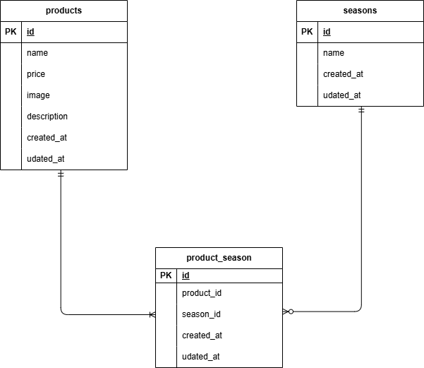

# 基礎学習ターム 確認テスト_もぎたて

## 環境構築
**Dockerビルド**
1. git@github.com:Toriyamayoshihiro/checktest2.git
2. DockerDesktopアプリを立ち上げる
3. `docker-compose up -d --build`

> *MacのM1・M2チップのPCの場合、`no matching manifest for linux/arm64/v8 in the manifest list entries`のメッセージが表示されビルドができないことがあります。
エラーが発生する場合は、docker-compose.ymlファイルの「mysql」内に「platform」の項目を追加で記載してください*
``` bash
mysql:
    platform: linux/x86_64(この文追加)
    image: mysql:8.0.26
    environment:
```

**Laravel環境構築**
1. `docker-compose exec php bash`
2. `composer install`
3. .envファイルを作成
4. .envに以下の環境変数を追加
``` text
DB_CONNECTION=mysql
DB_HOST=mysql
DB_PORT=3306
DB_DATABASE=laravel_db
DB_USERNAME=laravel_user
DB_PASSWORD=laravel_pass
```
5. アプリケーションキーの作成
``` bash
php artisan key:generate
```

6. マイグレーションの実行
``` bash
php artisan migrate
```

7. シーディングの実行
``` bash
php artisan db:seed
```

8. シンボリックリンクの実行
``` bash
php artisan storage:link
```

## 使用技術(実行環境)
- PHP8.4.10
- Laravel 8.83.29
- MySQL8.0.26

## ER図


## URL
- 開発環境：http://localhost/
- phpMyAdmin:：http://localhost:8080/

## 補足
productsテーブルのdescriptionカラムをdiscriptionと設定したため、
composer require doctrine/dbalコマンドで"doctrine/dbal"をインストールし
2025_11_01_193010_rename_discription_to_description_in_products_tableファイルを作成し、マイグレートしたが
Symfony\Component\ErrorHandler\Error\FatalError
Declaration of Illuminate\Database\PDO\Concerns\ConnectsToDatabase::connect(array $params) must be compatible with Doctrine\DBAL\Driver::connect(array $params): Doctrine\DBAL\Driver\Connection
 Whoops\Exception\ErrorException
 Declaration of Illuminate\Database\PDO\Concerns\ConnectsToDatabase::connect(array $params) must be compatible with Doctrine\DBAL\Driver::connect(array $params): Doctrine\DBAL\Driver\Connection
 上のエラーが返ってきて変更できませんでした。
